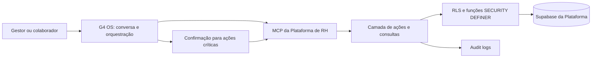

# Arquitetura de Integração Nativa G4 OS — Plataforma de RH

**Projeto:** Plataforma de RH — Grupo Trevo  
**Data de referência:** 5 de agosto de 2026  
**Status:** Diretriz de produto e arquitetura

## 1. Objetivo

Transformar a Plataforma de RH em uma ferramenta operacional orientada por contexto: gestores e colaboradores devem conseguir consultar informações, registrar fatos, gerar documentos, iniciar fluxos e delegar trabalho em linguagem natural, a partir do G4 OS — com as mesmas regras de acesso, aprovações e trilha de auditoria da plataforma.

O G4 OS não será uma segunda interface de administração nem terá acesso irrestrito ao banco. Será a camada conversacional e de orquestração da plataforma.

## 2. Modelo operacional: Platform-first, API-first, AI-optional

A Plataforma de RH é o produto operacional principal. Todo colaborador deve conseguir cumprir sua jornada — consultar dados, processos, tarefas, documentos, treinamentos, comunicados e solicitações — diretamente por ela, sem precisar de acesso ao G4 OS.

O G4 OS é uma camada opcional de produtividade para usuários autorizados, sobretudo gestores, RH e administração. Ele acelera consultas, análises, preparação de ações e automações, mas não substitui as telas, fluxos ou controles nativos.

A plataforma também deve expor uma API segura e documentada para integrar relógio de ponto, ferramentas atuais da empresa, assinatura digital, mensageria, recrutamento e demais sistemas. Integrações externas e G4 OS consomem o mesmo domínio de negócio, com regras consistentes.

## 3. Princípios obrigatórios

1. **Uma única fonte de verdade:** dados continuam pertencendo ao banco Supabase da Plataforma de RH.
2. **Funcionalidade nativa completa:** cada recurso utilizado por colaboradores existe e é utilizável na plataforma, inclusive quando não há G4 OS disponível.
3. **Permissões espelhadas:** cada chamada do G4 OS ou de API é executada em nome de uma identidade autorizada e respeita RLS, papéis, autonomia e escopo de empresa.
4. **Ações sensíveis exigem confirmação:** advertências, feedbacks formais, avaliações, assinatura de documentos, desligamentos, alteração salarial e qualquer ação de impacto devem apresentar resumo e solicitar confirmação explícita antes da gravação.
5. **Auditoria integral:** cada ação registra ator, origem (`ui`, `g4os` ou integração), solicitação/resumo, resultado, data e entidade afetada em `audit_logs`.
6. **Nenhum segredo no cliente:** service role, chaves de API e integrações externas ficam apenas em handlers/server functions, cofre de segredos ou servidores MCP; nunca no navegador ou no chat.
7. **Human-in-the-loop:** o G4 OS pode preparar, recomendar e executar ações autorizadas, mas não deve inferir fatos disciplinares, avaliações ou decisões de RH sem validação humana.
8. **Respostas com contexto mínimo necessário:** consultas sobre pessoas devem aplicar necessidade de conhecimento, evitando expor dados sensíveis fora do escopo do solicitante.
9. **Integração resiliente:** chamadas externas devem ser autenticadas, versionadas, idempotentes, observáveis e capazes de reprocessamento seguro.

## 4. Modelo de integração

### 4.1 Fonte MCP da Plataforma de RH

Criar uma fonte/conector MCP dedicada, por exemplo `plataforma-rh`, com ferramentas pequenas, tipadas e paginadas. Ela expõe somente capacidades de negócio, nunca acesso genérico a tabelas ou SQL.

**Padrão de ferramentas**
- Consultas: `search_*`, `get_*`, `list_*`, sempre com filtros e limite.
- Preparação: `draft_*` ou `preview_*`, sem persistência definitiva.
- Ações: `create_*`, `update_*`, `delegate_*`, `submit_*`, `approve_*`.
- Ações sensíveis: requerem `confirmed: true`, após uma prévia devolvida ao usuário.

### 4.2 Identidade e autorização

- O conector recebe o usuário autenticado do G4 OS e o associa ao `auth.uid()` da Plataforma de RH.
- Server functions usam `requireSupabaseAuth` quando a ação deve refletir a permissão do solicitante.
- Operações administrativas excepcionais usam `supabaseAdmin` importado dinamicamente dentro do handler, com autorização de papel validada antes da execução.
- A matriz de autonomia é a referência para habilitar ou negar ferramentas e ações do G4 OS.

## 5. Capacidades prioritárias

### 5.1 Gestão diária de equipe

| Intenção pelo chat | Ação da plataforma | Controle |
|---|---|---|
| “Quais tarefas críticas da minha equipe vencem esta semana?” | Consulta tarefas, responsáveis, prazos e bloqueios | Escopo de gestor e empresa |
| “Crie uma tarefa para Ana revisar o procedimento até sexta” | Prévia e criação de tarefa com responsável, prazo e checklist | Confirmação antes de criar |
| “Delegue a rotina de fechamento para o João” | Atribui tarefa ou instancia processo | Valida `tasks.edit` e vínculo com equipe |
| “Mostre o que está atrasado no setor” | Consolida tarefas, processos, ocorrências e reuniões | Dados agregados e paginados |

### 5.2 Reuniões, feedback e advertências

| Intenção pelo chat | Ação da plataforma | Controle |
|---|---|---|
| “Enviei a gravação da reunião com a Maria; transforme em feedback” | Upload privado, transcrição, extração de rascunho e vínculo ao perfil | Gestor/RH autorizado; revisão humana |
| “Registre uma advertência a partir desta reunião” | Cria rascunho de ocorrência/advertência, evidências e fluxo de ciência/assinatura | Confirmação reforçada e justificativa obrigatória |
| “Quais combinados ficaram da reunião?” | Resume transcrição e sugere tarefas | Tarefas só são criadas após confirmação |

**Regra:** uma gravação nunca produz automaticamente uma advertência, nota disciplinar ou avaliação. O G4 OS pode sugerir classificação e redigir o conteúdo, mas a decisão e assinatura pertencem ao gestor/RH.

### 5.3 Avaliação de desempenho e metas

| Intenção pelo chat | Ação da plataforma | Controle |
|---|---|---|
| “Vamos avaliar o desempenho da Carla neste ciclo” | Recupera ciclo, cargo, critérios, metas e histórico autorizado | Mostra contexto permitido |
| “Com base nesta conversa, preencha um rascunho de avaliação” | Gera notas/comentários sugeridos por critério | Rascunho revisável; não submete |
| “Crie uma meta SMART para o próximo trimestre” | Gera meta, itens S/M/A/R/T e intervalo | Confirmação; só gestor/RH/admin cria |
| “Quais pontos devo abordar na 1:1?” | Sugere pauta com metas, tarefas, avaliações e ocorrências visíveis | Sem extrapolar dados restritos |

### 5.4 Conhecimento de cargo e autoatendimento

- Consultar descrição de cargo, responsabilidades, área, processos, manuais e políticas aplicáveis.
- Responder “o que devo fazer?” usando conteúdo oficial versionado, citando o documento/processo de origem.
- Orientar o colaborador a abrir solicitações de self-service (documentos, férias, atualização cadastral) e registrar a solicitação mediante confirmação.
- Nunca fornecer instrução que substitua política oficial quando o material estiver ausente; sinalizar lacuna para RH.

### 5.5 Inteligência operacional

- Resumos de equipe: headcount, aniversariantes, pendências, treinamentos, metas em risco, absenteísmo e tarefas críticas.
- Briefings antes de reuniões: perfil permitido do participante, últimos feedbacks, metas, tarefas abertas e pauta recomendada.
- Alertas proativos somente quando houver regra configurada e destinatário autorizado: documento a vencer, prazo de avaliação, tarefa bloqueada, treinamento obrigatório pendente.

## 6. Novos módulos e integração já na origem

Os módulos pendentes devem nascer com ferramentas MCP, auditoria e permissões planejadas:

1. **Documentos, holerites e assinatura:** preparar envio individual/lote, acompanhar assinaturas e cobrar pendências; documento e destinatários sempre mostrados antes do disparo.
2. **Faltas, atrasos e atestados:** registrar ocorrência ou anexar atestado, encaminhar para RH e gerar consolidações por equipe; dados médicos devem ter acesso altamente restrito.
3. **Comunicados e aniversariantes:** redigir comunicado, selecionar público, pré-visualizar e publicar após confirmação; painel de aniversariantes respeita consentimento e regras internas.
4. **Admissão, desligamento e recrutamento:** abrir requisições, acompanhar aprovações e vagas, resumir candidatos autorizados, criar tarefas de onboarding/offboarding.
5. **Treinamentos:** recomendar trilhas conforme cargo, consultar progresso e criar campanhas de treinamento; certificados e ranking somente conforme política de visibilidade.
6. **Pesquisa de clima:** criar campanhas, acompanhar taxa de resposta e consolidar resultados anonimizados; nunca revelar respostas individuais quando a política exigir anonimato.

## 7. Fluxo padrão de uma ação pelo G4 OS

1. O usuário descreve a intenção em linguagem natural.
2. O G4 OS identifica a capacidade e consulta somente o contexto necessário.
3. A ferramenta retorna uma prévia estruturada: entidade, campos, destinatários, impactos e permissões verificadas.
4. O G4 OS apresenta o resumo e solicita confirmação quando a ação alterar dados, notificar pessoas ou tiver impacto de RH.
5. Após confirmação, a ferramenta executa a server function em nome do usuário.
6. A Plataforma grava a alteração e um evento de auditoria com origem G4 OS.
7. O G4 OS retorna o resultado, links internos e próximos passos.

## 8. API aberta e ecossistema de integrações

### 8.1 Implantação progressiva: pronta sem depender de conexão externa

A primeira versão deve disponibilizar a API e o painel de integrações, mas não exigir nenhum fornecedor conectado para que o produto opere. Cada conector nasce em um destes estados: `disabled`, `sandbox`, `configured`, `active` ou `error`.

- **`disabled`:** módulo funciona por cadastro e operação manual na plataforma.
- **`sandbox`:** endpoints e webhooks podem ser testados com dados de demonstração, sem acionar ferramentas reais.
- **`configured`:** credenciais e mapeamentos foram validados, mas o processamento produtivo ainda não foi liberado.
- **`active`:** eventos e sincronizações reais estão autorizados.
- **`error`:** a falha é registrada, alertada e reprocessável, sem interromper a operação manual.

A API pública terá ambiente de teste, credenciais próprias de sandbox e coleções de exemplo. Isso permite validar chamadas, payloads e webhooks agora, mesmo antes de escolher ou conectar relógio de ponto, assinatura digital, ATS ou mensageria.

### 8.2 Camadas da API

- **API pública versionada (`/api/v1`):** recursos e ações de negócio documentados por OpenAPI; nunca acesso direto a tabelas.
- **Webhooks de saída:** notificam sistemas autorizados sobre eventos como documento assinado, tarefa concluída, processo atrasado, treinamento vencido, ausência registrada, aprovação/reprovação e mudança de colaborador.
- **Endpoints de entrada:** recebem eventos de fornecedores, como registros do relógio de ponto, estado de assinatura digital, candidatos e atualizações de treinamento.
- **Fila de integração:** processa trabalhos assíncronos, retentativas e falhas sem bloquear a experiência do usuário.
- **Painel de integrações:** configura credenciais, escopos, eventos, status, logs, reprocessamento e responsáveis por cada conexão.

### 8.3 Segurança da API

- Chaves por integração, com escopos mínimos (`employees.read`, `attendance.write`, `documents.send`, etc.), validade, rotação e revogação.
- OAuth 2.1 quando a ferramenta parceira suportar delegação por usuário; chave de serviço limitada para integrações servidor-servidor.
- Assinatura HMAC e timestamp nos webhooks, com proteção contra replay.
- Limite de taxa, paginação, filtros e versionamento sem quebra.
- Cada chamada persiste `integration_id`, correlação, origem e resultado na auditoria.

### 8.4 Integração com relógio de ponto e jornada

O relógio de ponto permanece como sistema especializado de marcação; a Plataforma de RH consolida e monitora a operação. A integração deve:

1. Associar o identificador externo ao colaborador e empresa corretos.
2. Receber marcações, justificativas, banco de horas e eventos de ajuste de forma idempotente.
3. Exibir jornada planejada x realizada, atrasos, faltas e inconsistências para os papéis autorizados.
4. Abrir alertas e fluxos internos — por exemplo, solicitação de justificativa, anexação de atestado ou revisão por RH — sem alterar a marcação de origem indevidamente.
5. Manter os dados sensíveis de jornada e saúde sob permissões específicas e prazo de retenção definido.

### 8.5 Central de Importações e leitura de documentos

Enquanto um sistema externo não estiver conectado, a plataforma deve permitir importação controlada de dados e documentos.

**Importações estruturadas**
- Modelos CSV/XLSX com validação e prévia antes de gravar: colaboradores, empresas, vínculos, tarefas, metas, jornadas, faltas, treinamentos, candidatos e dados históricos.
- Mapeamento de colunas salvo por origem, com relatório de linhas aceitas, rejeitadas e duplicadas.
- Processamento assíncrono e idempotente: uma reimportação do mesmo arquivo não pode criar registros repetidos.
- Modo “validar somente” antes da confirmação definitiva; todo lote possui responsável, data, arquivo original e possibilidade de reversão quando tecnicamente segura.

**Documentos e extração assistida**
- Upload de PDF, imagem, DOCX e planilha para buckets privados, com antivírus/validação de tipo e controle de acesso.
- Extração de texto e metadados em segundo plano; OCR para documentos digitalizados quando aplicável.
- O sistema sugere classificação — por exemplo, holerite, atestado, documento pessoal, certificado ou evidência de processo — e campos como colaborador, competência e validade.
- A sugestão nunca é vinculada ou publicada automaticamente: RH/gestor autorizado revisa, corrige e confirma o destino.
- Arquivos importados ficam associados a uma origem e um lote para auditoria, retenção e descarte conforme a política da empresa.

Essa central permite começar a usar documentos, holerites, dados de ponto e históricos já existentes sem esperar uma integração oficial. Quando a integração for ativada, o mesmo modelo de negócio é usado; muda apenas a origem do dado, de `import` para `integration`.

### 8.6 Notificações e conformidade

A plataforma deve emitir notificações configuráveis para canais já usados pela empresa (e-mail, mensageria, webhook e, quando aplicável, G4 OS):

- documentos e holerites pendentes de assinatura;
- treinamentos obrigatórios vencendo ou vencidos;
- tarefas e processos críticos atrasados;
- aprovação pendente de contratação, desligamento ou solicitação;
- documento de colaborador próximo do vencimento;
- inconformidades de jornada dentro do escopo autorizado.

Notificação é um aviso e link para a ação; detalhes sensíveis não devem ser enviados a canais não autorizados.

## 9. Backlog técnico inicial

### Fundação
- Definir contrato MCP (`plataforma-rh`) e catálogo de ações por módulo.
- Mapear cada ferramenta para uma chave da matriz de autonomia existente.
- Padronizar `audit_logs` com `origin`, `request_summary`, `g4os_session_id` e referência de ação.
- Criar camada de server functions própria para integrações conversacionais, sem lógica de negócio duplicada.
- Implementar idempotência para criações e envios, evitando duplicidade em reexecuções.

### Primeira entrega recomendada: Copiloto de gestores
- Consultar equipe, tarefas, metas e agenda.
- Criar, delegar e acompanhar tarefas/processos.
- Gerar pauta e resumo de reunião.
- Transformar gravação/transcrição em rascunho de feedback e tarefas.
- Preparar rascunhos de avaliação de desempenho e metas SMART.

### Segunda entrega: Central documental e assinatura
- Documento por colaborador e lote.
- Envio, assinatura, lembretes, status e prova de aceite.
- Arquivo central vinculado ao perfil, validade e alertas.

### Terceira entrega: Operação de RH
- Faltas, atrasos, atestados e ocorrências.
- Comunicados e aniversariantes.
- Requisições de contratação/desligamento com aprovações.

### Quarta entrega: Talentos e desenvolvimento
- Recrutamento e seleção.
- Trilhas, treinamentos, certificados e ranking.
- Pesquisas internas e painéis agregados de clima.

## 10. Critérios de aceite para integração G4 OS e API

- Um gestor só consegue consultar e agir sobre colaboradores e empresas que já poderia acessar na Plataforma de RH.
- Toda ação de escrita do G4 OS resulta no mesmo estado e regras da UI nativa.
- Ações com impacto disciplinar, contratual, financeiro ou de comunicação em massa exigem confirmação explícita.
- O histórico de auditoria identifica que a ação foi iniciada pelo G4 OS, por quem e quando.
- Uma gravação pode gerar rascunhos e sugestões, mas não uma medida formal automática.
- Consultas e ações devem ter respostas claras quando a permissão for insuficiente, sem vazar dados restritos.
- Ferramentas MCP são orientadas a negócio, tipadas, com paginação e sem exposição de SQL ou credenciais.
- O fluxo essencial do colaborador funciona pela UI nativa sem depender de acesso ao G4 OS.
- A API pública usa escopos mínimos, versionamento, idempotência, auditoria e documentação de contrato.
- Eventos de relógio de ponto e demais integrações externas não geram duplicidade quando reenviados e deixam registro de correlação e processamento.
- Webhooks de conformidade são assinados, reprocessáveis e não expõem dados pessoais ou sensíveis além do necessário.
- A plataforma segue operando quando todos os conectores estiverem desativados, por meio de operação manual e importações controladas.
- A API de sandbox permite testar autenticação, endpoints e webhooks sem transmitir dados produtivos a um fornecedor externo.
- Todo lote importado tem prévia, validação, responsável, arquivo de origem, resultado por linha e rastreabilidade na auditoria.
- A leitura automática de documentos só sugere classificação e metadados; o vínculo final a colaborador, documento ou ocorrência depende de confirmação de usuário autorizado.

## 11. Modelo adaptável de organizações, relações e autonomia

A estrutura organizacional deve representar a realidade operacional do Grupo Trevo: pessoas pertencem a empresas e unidades, respondem formalmente a gestores, mas também colaboram com áreas técnicas e responsáveis funcionais que não possuem, por esse motivo, autoridade hierárquica ou acesso irrestrito.

### 11.1 Três conceitos distintos

| Conceito | O que representa | O que não concede automaticamente |
|---|---|---|
| **Hierarquia formal** | Gestor direto, gestores secundários, subordinados e aprovações de pessoas | Acesso geral às rotinas, documentos ou dados de outras áreas |
| **Relação funcional** | Coordenação técnica, interface entre áreas, mentoria, responsável por tema ou operação compartilhada | Poder disciplinar, aprovação de RH, leitura de dados sensíveis ou alteração de dados fora do escopo |
| **Autonomia e permissão** | Quais ações o usuário pode realizar, sobre quais dados e em qual escopo | Vínculo automático por cargo, área ou relação de trabalho |

A regra estrutural é: **uma relação explica colaboração; somente uma permissão explícita autoriza uma ação.**

### 11.2 Escopo de autorização

Toda concessão deve combinar uma ação com um escopo. O mesmo usuário pode ter autorizações diferentes por empresa, unidade, área, equipe, processo, projeto, colaborador ou módulo.

Exemplos de escopo:

- **Empresa:** Trevo, ou outra empresa do grupo.
- **Unidade:** Posto Trevo específico, matriz, filial, operação logística.
- **Área:** financeiro, manutenção, logística, abastecimento, documentação, RH ou SGI.
- **Equipe, processo ou projeto:** responsáveis por uma rotina ou frente transversal.
- **Pessoas nomeadas:** carteira específica de motoristas, colaboradores, candidatos ou terceiros.
- **Tipo de dado:** operacional, pessoal, disciplinar, médico, financeiro, documento ou treinamento.

Exemplo: a gerente financeira pode ter uma relação funcional com o chefe de caixa de um posto e acesso a indicadores financeiros daquela unidade, sem obter o direito de alterar dados pessoais, aplicar advertências ou aprovar férias. A gerente da unidade, por outro lado, pode ser a gestora hierárquica e aprovar rotinas de equipe, mas não necessariamente acessar relatórios financeiros corporativos.

### 11.3 Papéis compostos e concessões direcionadas

O sistema não deve deduzir acesso somente do cargo. Cada usuário recebe uma composição de:

1. **Papéis de sistema** — administrador, RH, gestor, colaborador, auditor, recrutador etc.
2. **Nível de autonomia** — catálogo de capacidades por ação, já existente na plataforma.
3. **Escopos de atuação** — empresas, unidades, áreas, processos, equipes e carteiras sob sua responsabilidade.
4. **Relações funcionais** — vínculo declarativo que indica como a pessoa participa de uma operação, sem elevar privilégios por si só.
5. **Exceções temporárias** — delegação com início, fim, motivo, concedente e revogação automática.

Isso permite que uma pessoa seja, ao mesmo tempo, gestora de uma unidade, responsável técnica por uma rotina de outra área e colaboradora em uma empresa diferente — cada vínculo com suas próprias ações permitidas.

### 11.4 Aplicação ao caso de motoristas

Motoristas podem ter um gestor principal para gestão de pessoas e, paralelamente, responsáveis funcionais por domínio:

| Domínio | Exemplo de capacidade possível | Limite obrigatório |
|---|---|---|
| Manutenção | Registrar e acompanhar solicitações de manutenção do veículo | Não altera dados de RH ou aplica sanções |
| Logística | Planejar rotas, acompanhar entregas e tarefas de operação | Não acessa atestados ou documentos médicos |
| Abastecimento | Registrar consumo, inconformidades e aprovar rotina autorizada | Não modifica cargo, salário ou férias |
| Documentação | Solicitar/validar documentos de veículo ou condutor | Não lê avaliação de desempenho sem concessão explícita |
| RH | Gerir dados pessoais, documentos e processos de pessoal | Sem acesso automático a indicadores financeiros |
| SGI | Registrar treinamentos, inspeções, incidentes e evidências | Sem poder disciplinar automático |

Cada responsável recebe uma carteira e permissões de domínio explícitas. O motorista pode visualizar quem é responsável por cada tema e abrir solicitações diretamente para a fila correta.

### 11.5 Regras de decisão de acesso

Para cada consulta ou alteração, a plataforma e o G4 OS devem avaliar:

1. Identidade do solicitante e papéis ativos.
2. Ação solicitada, como `tasks.update`, `attendance.view`, `employee_documents.read` ou `performance.manage`.
3. Escopo do recurso: empresa, unidade, área, colaborador, processo e classificação do dado.
4. Concessão explícita válida — por papel, autonomia, carteira, delegação ou relação com escopo autorizado.
5. Restrições e bloqueios explícitos, priorizados sobre permissões genéricas.
6. Requisito adicional de aprovação, confirmação ou dupla checagem para ações críticas.

A avaliação deve ser feita no backend/RLS e nas server functions. A interface apenas reflete o resultado — nunca é a barreira de segurança final.

### 11.6 Capacidades administrativas necessárias

A plataforma deve oferecer telas de administração para:

- manter empresas, unidades, áreas, equipes e processos como escopos reutilizáveis;
- vincular uma pessoa a múltiplos escopos, com marcação de principal quando aplicável;
- criar relações funcionais tipadas e responsabilidades por assunto;
- atribuir e remover carteiras de colaboradores, veículos, processos ou candidatos;
- conceder delegações temporárias com data de expiração;
- visualizar o “por que tem acesso” de cada usuário e recurso;
- simular permissões antes de publicar uma alteração;
- revisar periodicamente acessos e identificar concessões vencidas ou conflitantes.

A aba de Organograma deve continuar mostrando a hierarquia e passar a distinguir visualmente relações funcionais, carteiras e permissões — sem confundir conexão com autoridade.

### 11.7 Critérios de aceite de adaptabilidade

- Um cargo, empresa, unidade ou relação funcional isolados não concedem permissões implícitas.
- Um usuário pode receber permissões distintas em múltiplas empresas e unidades simultaneamente.
- Uma pessoa pode ter vários gestores, responsáveis técnicos e carteiras, cada qual identificado pelo tipo de vínculo.
- Permissões temporárias expiram automaticamente e ficam auditadas.
- O sistema informa de forma compreensível a origem de uma autorização ou de uma recusa.
- Consultas sensíveis respeitam simultaneamente ação, escopo e classificação do dado.
- O G4 OS usa exatamente a mesma decisão de autorização da plataforma e não amplia privilégios por contexto conversacional.

## 12. Decisão de produto

A Plataforma de RH deve ser concebida como o sistema transacional e visual de referência; o G4 OS, como interface conversacional, analítica e de automação segura. Assim, um gestor pode executar o trabalho cotidiano pelo chat quando isso for mais rápido, e usar as telas da plataforma para revisão, operação detalhada e rastreabilidade.
